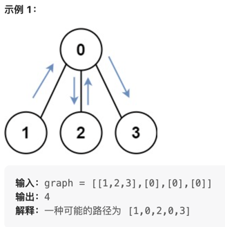

# Week 10
## [743. 网络延迟时间](https://leetcode.cn/problems/network-delay-time/description/)
>
> 有 n 个网络节点，标记为 1 到 n。
给你一个列表 times，表示信号经过 有向 边的传递时间。 times[i] = (ui, vi, wi)，其中 ui 是源节点，vi 是目标节点， wi 是一个信号从源节点传递到目标节点的时间。
现在，从某个节点 K 发出一个信号。需要多久才能使所有节点都收到信号？如果不能使所有节点收到信号，返回 -1 。


```text
输入：times = [[2,1,1],[2,3,1],[3,4,1]], n = 4, k = 2
输出：2
```

### solution
Dijkstra算法，求出从k开始到各个节点的距离，最大值
就是传播的时间。
```python
def networkDelayTime(self, times: list[list[int]], n: int, k: int) -> int:
    dis = [float('inf')] * n
    visited = [0] * n
    res = {}

    node = k - 1
    dis[node] = 0
    res[node] = 0
    visited[node] = 1

    while True:
        for way in times:
            a, b, t = way[0]-1, way[1]-1, way[2]
            #  从node开始的边
            if a != node:
                continue

            dis[b] = min(dis[b], dis[a] + t)

        min_cost = float('inf')
        min_index = k

        for k, v in enumerate(dis):
            #  记录最近的，不在访问列表里的节点
            if v < min_cost and visited[k] == 0:
                min_cost = v
                min_index = k

        if min_cost == float('inf'):  # 没找到可达路径
            return -1

        res[min_index] = int(dis[min_index])
        visited[min_index] = 1
        node = min_index

        if len(res) == n:
            res = sorted(res.items(), key=lambda x: x[1], reverse=True)
            return res[0][1]
```
写的比较冗余，效率不高但是很好理解


## [847. 访问所有节点的最短路径](https://leetcode.cn/problems/shortest-path-visiting-all-nodes/description/)
> 存在一个由 n 个节点组成的无向连通图，图中的节点按从 0 到 n - 1 编号。
给你一个数组 graph 表示这个图。其中，graph[i] 是一个列表，由所有与节点 i 直接相连的节点组成。
返回能够访问所有节点的最短路径的长度。你可以在任一节点开始和停止，也可以多次重访节点，并且可以重用边。



```text
输入：graph = [[1,2,3],[0],[0],[0]]
输出：4
解释：一种可能的路径为 [1,0,2,0,3]
```


### solution
首先使用 floyd 算法预处理出所有点对之间的最短路径长度。
用 f[u][mask]表示从任一节点开始到节点 u 为止，
并且经过的「关键节点」
对应的二进制表示为 mask时的最短路径长度。由于u 是最后一个「关键节点」，
那么在进行状态转移时，我们可以枚举上一个「关键节点」v，即：


其中 mask\u表示将 mask的第 u位从 1变为 0后的二进制表示。
也就是说，「关键节点」v 在 mask中的对应位置必须为 1，
将 f[v][mask\u]
加上从 v 走到 u 的最短路径长度为 d(v,u)，
取最小值即为 f[u][mask]。

最终的答案即为：min f[u][2^n -1]

```python
def shortestPathLength(self, graph: List[List[int]]) -> int:
    # 新建邻接矩阵
    n = len(graph)
    d = [[n + 1] * n for _ in range(n)]
    for i in range(n):
        for j in graph[i]:
            d[i][j] = 1

    # 使用 floyd 算法预处理出所有点对之间的最短路径长度
    for k in range(n):
        for i in range(n):
            for j in range(n):
                d[i][j] = min(d[i][j], d[i][k] + d[k][j])

    # dp数组，状态压缩
    f = [[float("inf")] * (1 << n) for _ in range(n)]

    for mask in range(1, 1 << n):
        # 如果 mask 只包含一个 1，即 mask 是 2 的幂
        if (mask & (mask - 1)) == 0:
            u = bin(mask).count("0") - 1
            f[u][mask] = 0
        else:
            for u in range(n):
                if mask & (1 << u):  # 从u开始，所以u必须在这个路经里
                    for v in range(n):
                        if (mask & (1 << v)) and u != v:  # v也在这个路经里，且不和u相等
                            f[u][mask] = min(f[u][mask], f[v][mask ^ (1 << u)] + d[v][u])

    ans = min(f[u][(1 << n) - 1] for u in range(n))
    return int(ans)
```

