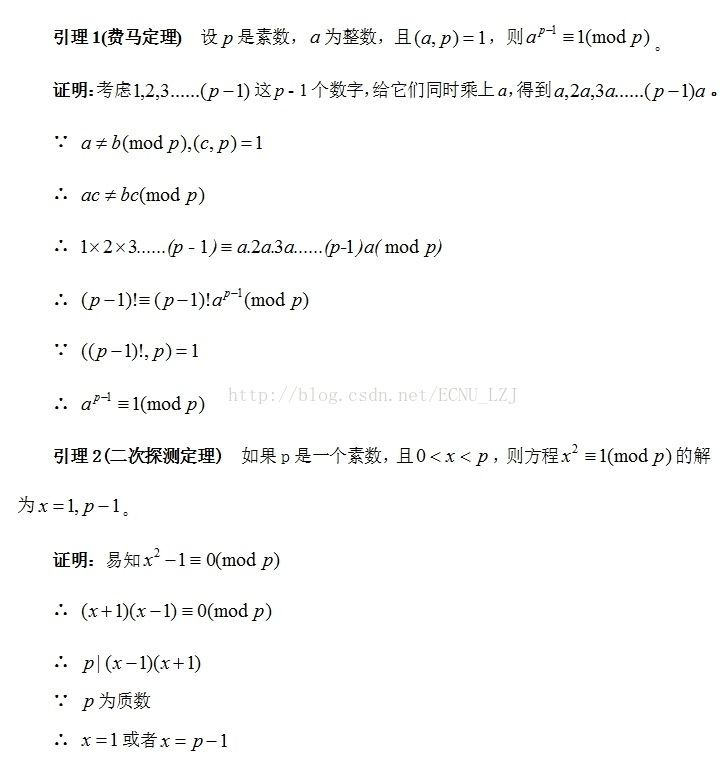

# 判断素数基础方法

## 算法一：

$O(\sqrt{n})$方法

+ 从2开始寻找，直到 。如果没有找到可以整除这个数的数，那么这个数是素数。

  ```python
  def isPrime(n):
      for k in range(2, int(n ** 0.5) + 1):
          if n % k == 0:
              return False
      return True
  ```

+ 最坏情况下需要遍历$\sqrt{n}-1$次，算法时间复杂度上界为$O(\sqrt{n})$

## 算法二：

优化算法1

+ 在大于等于5的正整数中，素数一定是出现在6的倍数的左右两边（其中一边或两边都是）。同时，出现在6的倍数的两边的数是可以被素数整除。

+ 因此遍历的步长可以增大，从而减小时间开销

  ```python
  def isPrime2(n):
      if 3 >= n > 1:  # 2,3
          return True
      if n % 6 != 1 and n % 6 != 5:  # 判断是否在6的倍数的两边,如果不在，则一定不是素数。
          return False
      #如果在，则需要进一步判断 (此时该数已经不是偶数)。
      for k in range(5, int(n ** 0.5) + 1, 6):  # 判断该数能否被从5到sqrt(n)+1中的素数整除。
          if n % k == 0 or n % (k + 2) == 0:  # 判断左边和右边是否可以被n整除。
              return False
      return True
  ```

  
## 算法三
Miller-Rabin素性测试算法
引理:

> https://blog.csdn.net/ECNU_LZJ/article/details/72675595/
> 
假设需要判断的数是p，把p−1分解为2^k∗t 的形式。当p是素数，有a^2^k∗t≡1(mod p)。
然后随机选择一个数a ，计算出a^t(mod p)
让其不断的自乘，同时结合二次探测定理进行判断
如果我们自乘后的数(mod p)=1 ，但是之前的数(mod p)≠ ±1。

那么这个数就是合数(违背了二次探测定理)
这样乘k 次，最后得到的数就是a^(p−1)

那么如果最后计算出的数不为1 ，这个数也是合数(费马小定理)

```python
def Miller_Rabin_raw(n):
    k, p = 0, n - 1
    while (p & 1) == 0:
        p = p >> 1
        k += 1
    for j in range(6):
        a = random.randint(1, n - 1)
        b = pow(a, p, n)
        flag = 0
        if b == 1:
            continue
        for i in range(k):
            if (b + 1) % n == 0:
                flag = 1
                break
            else:
                b = (b * b) % n
        if flag == 1:
            continue
        else:
            return False
    return True
```
---

## 测试：

```python
 no_prime_num = [201200, 202046, 202469, 202892, 203315,
                    203738, 204584, 205007, 205430, 205853,
                    206276, 207122, 207545, 207968, 208814,
                    216428, 217274, 218120, 218543, 218966,
                    219812, 220235, 220658, 221081, 221504,
                    221927, 222350, 223196, 223619, 224042,
                    224465, 224888, 225311, 225734, 226157]

  prime_num = [159937, 159977, 159979, 160001, 160009,
               160019, 160031, 160033, 160049, 160073,
               160079, 160081, 160087, 160091, 160093,
               210601, 210619, 210631, 210643, 210659,
               210671, 210709, 210713, 210719, 210731,
               210739, 210761, 210773, 210803, 210809,
               210811, 210823, 210827, 210839, 210853]

  test_num = no_prime_num + prime_num

  begin = time.perf_counter()
  for _ in range(1000):
      for i in test_num:
          res = isPrime(i)
  end = time.perf_counter()

  print('Res: {}, Time: {:.3f}ms'.format(res, end - begin))

  begin = time.perf_counter()
  for _ in range(1000):
      for i in test_num:
          res = isPrime(i)
  end = time.perf_counter()

  print('Res: {}, Time: {:.3f}ms'.format(res, end - begin))

 begin = time.perf_counter()
    for _ in range(1000):
        for i in test_num:
            res = Miller_Rabin_raw(i)
    end = time.perf_counter()

    print('Res: {}, Time: {:.3f}ms'.format(res, end - begin))
```

```text
Time: 0.406ms
Time: 0.337ms
Time: 0.420ms
```

算法2对比算法1，时间大概减少20%
算法3只有在很大的整数下才可显现性能优异


