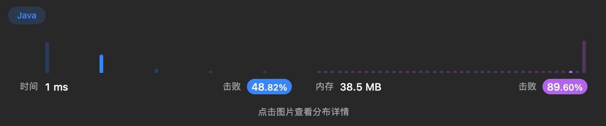

# Week 2 邰浩轩 2201212850
## Problem 7: reverse
### solution 1
反转整数`x`，对`10`取余数即可获取整数`x`个位上的数；将`x`除以`10`再取个位上的数字，
即可取到原来`x`的十位上的数字。
循环从个位直至最高位取数字，直至`x`为`0`。

未防止溢出，定义`max`与`min`进行判定，如果发生溢出返回`0`。
### code 1
```java
public int reverse(int x) {
    int res = 0;
    double max = (Math.pow(2, 31) - 1) / 10.0; // 确定最大值（除以10，在溢出前判断）
    double min = -Math.pow(2, 31) / 10.0; // 确定最小值（除以10，在溢出前判断）
    while(x != 0){ // 在x不为0前循环
        if(res > max || res < min){ // 如果下一步会发生溢出，即可返回0
            return 0;
        }
        res *= 10; // 左移res，单位为10
        res += x % 10; // 将当前x个位上的数添加至res内
        x /= 10; // 右移res，单位为10
    }
    return res;
}
```
### result 1
