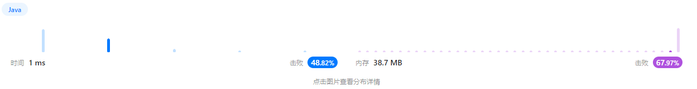
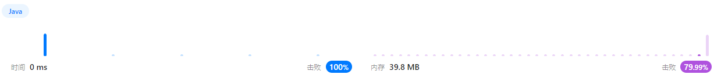
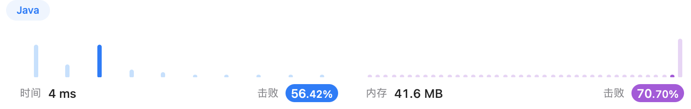
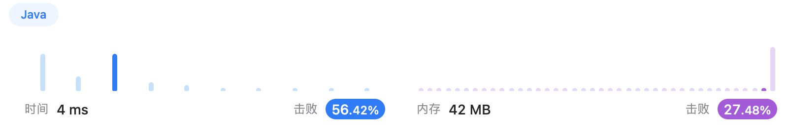

# Week 2 邰浩轩 2201212850 [AllCode](./Main.java)
## [Problem 7: reverse](https://leetcode.cn/problems/reverse-integer/description/)
### solution 1
反转整数`x`，对`10`取余数即可获取整数`x`个位上的数；将`x`除以`10`再取个位上的数字，
即可取到原来`x`的十位上的数字。
循环从个位直至最高位取数字，直至`x`为`0`。

未防止溢出，定义`max`与`min`进行判定，如果发生溢出返回`0`。
### code 1
```java
public int reverse(int x) {
    int res = 0;
    double max = (Math.pow(2, 31) - 1) / 10.0; // 确定最大值（除以10，在溢出前判断）
    double min = -Math.pow(2, 31) / 10.0; // 确定最小值（除以10，在溢出前判断）
    while(x != 0){ // 在x不为0前循环
        if(res > max || res < min){ // 如果下一步会发生溢出，即可返回0
            return 0;
        }
        res *= 10; // 左移res，单位为10
        res += x % 10; // 将当前x个位上的数添加至res内
        x /= 10; // 右移res，单位为10
    }
    return res;
}
```
### result 1

### solution 2
使用字符串构造结果。讲数字转化为一个字符串或一个列表。又后向前遍历，构造反序字符串。如果`x`为负，在字符串最前方添加`-`。
最后将字符串转化为long类型，判断溢出，若溢出则返回`0`，否则返回parse后的结果。
### code 2
```java
public int reverse(int x) {
    String number = String.valueOf(x);

    StringBuilder builder = new StringBuilder(); // 字符串builder
    int begin = 0; // 标识数字部分起始位置
    if(number.charAt(0) == '-'){
        builder.append('-'); // 添加负号
        begin++;
    }
    for(int index = number.length() - 1; index >= begin; index--){ // 由后向前遍历
        builder.append(number.charAt(index));
    }

    String resString = builder.toString();
    long res = Long.parseLong(resString); // 先转化成long类型
    if(-2147483648 <= res && res <= 2147483647){ // 如果在int区间内返回值
        return (int)res;
    }
    else return 0;
}
```
### result 2


## [Problem 66: plusOne](https://leetcode.cn/problems/plus-one/submissions/407806237/)
### solution 1
相当于手写高精度加法，主要问题为处理进位。将数组从后向前遍历。末位`+ 1`，利用`/ 10`记录进位（0或者1），
利用`% 10`计算本位真实值。遍历结束后如果还有进位就需要扩充数组，创建新数组拷贝已有数值，最高位设置为1。
如[9,9,9]进位，需要扩充为4个元素的数组，最高位1，其余按照`mod 10` 均为0，即[1,0,0,0]。
### code 1
```java
public int[] plusOne(int[] digits) {
    int len = digits.length;
    digits[len -1] += 1; // 最后一位+1
    int t = digits[len -1] / 10; // 记录进位
    digits[len -1] %= 10; // mod 10

    // 从倒数第二位遍历
    for(int i = len -2 ; i >= 0; i--){
        digits[i] = digits[i] + t; // 加上进位
        t = digits[i] / 10; // 记录新的进位
        digits[i] %= 10; // 计算mod 10
    }

    if(t == 1) { // 如果最后发生进位
        int[] res = new int[len + 1];
        System.arraycopy(digits, 0, res, 1, len); // 复制数组
        res[0] = 1;
        return res;
    }
    return digits;
}
```
### result 1


### solution 2
用python欺负c艹和java，直接累加高精度整数（不会溢出），再转数组。时间开销巨高。
### code 2
```python
def plusOne(self, digits: List[int]) -> List[int]:
    ans = 0
    res = list()
    for i in digits:
        ans = ans * 10 + i
    for i in str(ans + 1):
        res.append(int(i))
    return res
```
### result 2

### solution 1
暴力遍历字符串。首先创建字符与int所对应的map，其后遍历字符串每一个字符，如果当前字符为I，X，C则需要判断
下一位是否为目标字符，若是res减去当前字符对应值，否则加上当前字符对应值。

需要注意判断i+1是否溢出。

### code 1
```java
public int romanToInt(String s) {
    Map<Character, Integer> map = new HashMap<>();
    map.put('I',1);map.put('V',5);map.put('X',10);map.put('L',50);
    map.put('C',100);map.put('D',500);map.put('M',1000);

    int res = 0;
    for(int i = 0; i < s.length(); i++){ // 遍历整个字符串
        if(s.charAt(i) == 'I' && i+1 < s.length() &&
            (s.charAt(i+1) == 'V' || s.charAt(i+1) == 'X')){
            res -= 1; // 减去I对应值
        }
        else if(s.charAt(i) == 'X' && i+1 < s.length() &&
            (s.charAt(i+1) == 'L' || s.charAt(i+1) == 'C')){
            res -= 10; // 减去X对应值
        }
        else if(s.charAt(i) == 'C' && i+1 < s.length() &&
            (s.charAt(i+1) == 'D' || s.charAt(i+1) == 'M')){
            res -= 100; // 减去C对应值
        }
        else {
            res += map.get(s.charAt(i)); // 加上对应值
        }
    }
    return res;
    }
```

### result 1


### solution
由于排列时大的数字在左侧，小的在右侧，因此可以从右到左遍历，记录当前遇到的最大的数字
（由`I`向`M`增加）， 遇到更大的就加，并且更新最大数，遇到小的就减
（遇到小的说明大小相反，需要减去当前值）。
### code 2
```java
public int romanToInt2(String s) {
    Map<Character, Integer> map = new HashMap<>();
    map.put('I',1);map.put('V',5);map.put('X',10);map.put('L',50);
    map.put('C',100);map.put('D',500);map.put('M',1000);

    int res = 0;
    int top = 1; // 记录最大值
    for(int i = s.length() - 1; i >= 0; i--) { // 遍历整个字符串
        int value = map.get(s.charAt(i)); // 获取数字
        if(value >= top){ // 如果当前值比最大值大，更新最大值
            res += value;
            top = value;
        }else { // 遇到了小的值，需要减去当前值
            res -= value;
        }
    }
    return res;
}
```

### result 2
