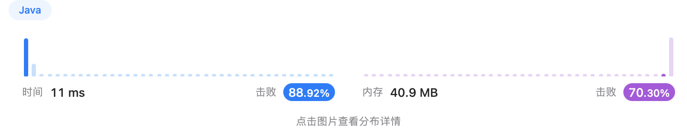
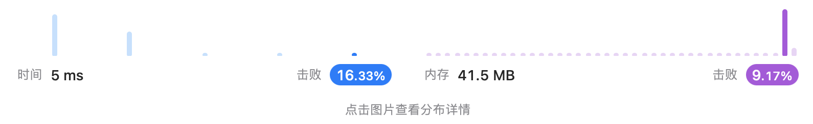
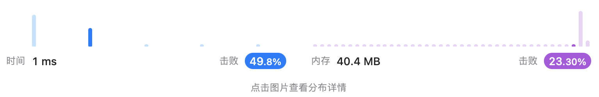
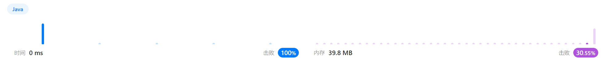
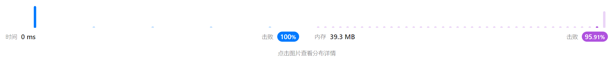

# Week 2 邰浩轩 2201212850 [AllCode](./Main.java)
## [Problem 16. 最接近的三数之和](https://leetcode.cn/problems/3sum-closest/)
> 给你一个长度为 n 的整数数组 nums 和 一个目标值 target。请你从 nums 中选出三个整数，使它们的和与 target 最接近。
> 
> 返回这三个数的和。
> 假定每组输入只存在恰好一个解。
```text
示例 1：

输入：nums = [-1,2,1,-4], target = 1
输出：2
解释：与 target 最接近的和是 2 (-1 + 2 + 1 = 2) 。
        
     
示例 2：

输入：nums = [0,0,0], target = 1
输出：0
```
### solution 1
暴力枚举，三层for嵌套，寻找abs最小的sum值，时间复杂度为$O(n^3)$。
测试提交，果然超时。
```java
public int threeSumClosest(int[] nums, int target) {
    int len = nums.length;
    int min = Integer.MAX_VALUE;
    int res = 0;
    for(int i = 0; i < len; i++){
        for(int j = 0; j < len; j++){
            if (i == j)
                continue;
            for(int k = 0; k < len; k++){
                if (i == k || j == k){
                    continue;
                }
                int sum = nums[i] + nums[j] + nums[k];
                if(Math.abs(target-sum) < min){
                    min = Math.abs(target-sum);
                    res = sum;
                }
            }
        }
    }
    return res;
}
```
### solution 2
受到两数字之和的双指针方法启发，在本题中依旧可以寻找利用双指针的解法。

由于只有两个指针，所以需要遍历第一个元素，且由于双指针的使用条件，需要对数组首先进行排序。
首先枚举第一个元素 $a$，对于剩下的两个元素 $b$ 和 $c$，期望三数之和最接近 $target$。

因此，使用两个指针 $l$与 $r$（$l$为$a.index + 1$, $r$为 $num.len-1$），当 $a + b + c < sum$时,
$l$右移，反之 $r$左移。每次记录最小值，当l与r重合时结束遍历，此时遍历下一个a值。
```java
public int threeSumClosest2(int[] nums, int target) {
    int len = nums.length;
    int min = Integer.MAX_VALUE; // 记录最接近的值
    Arrays.sort(nums); // 排序
    int res = 0;
    for(int i = 0; i <= len - 3; i++){ // a从第一个元素取到倒数第三个元素
        int l = i + 1;
        int r = len - 1;
        while(l < r){ // 双指针遍历
            int sum = nums[i] + nums[l] + nums[r];

            if(Math.abs(target-sum) < min){ // 记录最小值
                min = Math.abs(target-sum);
                res = sum;
            }

            if(sum < target)
                l++; // 比target小
            else if(sum > target)
                r--; // 比target大
            else
                return sum;
        }
    }
    return res;
```
### result

---

## [Problem 17. 电话号码的字母组合](https://leetcode.cn/problems/letter-combinations-of-a-phone-number/description/)
> 给定一个仅包含数字 2-9 的字符串，返回所有它能表示的字母组合。答案可以按 任意顺序返回。
>给出数字到字母的映射如下（与电话按键相同）。注意 1 不对应任何字母。


```text
示例 1：

输入：digits = "23"
输出：["ad","ae","af","bd","be","bf","cd","ce","cf"]
        
     
示例 2：

输入：digits = ""
输出：[]
```

### solution 1
唯有暴力方法解决。首先定义一个map存储数字与字母的对应关系。对第一个字符进行处理，将其对应字母加入到一个列表当中。

接下来对所有的数字进行遍历，从列表中当前的所有结果（和递归有点像，这个题肯定也可以用递归解决），分别加上当前数字对应的字母，
并加入新的列表。

整个过程看为广度优先遍历。
```java
public List<String> letterCombinations(String digits) {
    // 初始化map
    Map<Integer, char[]> map = new HashMap<>();
    map.put(2, new char[]{'a', 'b', 'c'});
    map.put(3, new char[]{'d', 'e', 'f'});
    map.put(4, new char[]{'g', 'h', 'i'});
    map.put(5, new char[]{'j', 'k', 'l'});
    map.put(6, new char[]{'m', 'n', 'o'});
    map.put(7, new char[]{'p', 'q', 'r', 's'});
    map.put(8, new char[]{'t', 'u', 'v'});
    map.put(9, new char[]{'w', 'x', 'y','z'});


    List<String> list = new ArrayList<>();
    if(digits.isEmpty()){ // 空串返回
        return new ArrayList<>();
    }else{ // 添加第一个数字对应的字符
        int c = digits.charAt(0) - '0';
        char[] chars = map.get(c);
        for(char one : chars){
            list.add(String.valueOf(one));
        }
        
    }

    for(int i = 1; i < digits.length(); i++){ // 遍历所有数字（除了第一位）
        List<String> temp = new ArrayList<>(); // 创建中间结果存储数组
        int c = digits.charAt(i) - '0'; // 获取数字
        char[] chars = map.get(c); // 得到对应字母
        for(char one : chars){ // 遍历所有字符 ，如 a,b,c
            for(String s: list){ // 遍历已有的字符，如w,x,y,z
                temp.add(s+one); // 拼接字符，如 wa,wb,wc,... 存储在中间结果中
            }
        }
        list = temp; // 获取中间结果
    }

    return list;
}
```
### result


### solution 2

对方法1进行优化，采用队列存储结果，降低空间消耗。

```java
/** 省略前序相同步骤 **/

for(int i = 1; i < digits.length(); i++){ // 遍历所有数字（除了第一位）
    int c = digits.charAt(i) - '0'; // 获取数字
    char[] chars = map.get(c); // 得到对应字母
    while(res.peek().length() <= i){ // 遍历队列中的长度不够的字符串
        String old = res.poll(); // 取队列头
        for(char one : chars){ // 遍历所有字符 ，如 a,b,c
            res.add(old+one); // 加入队列尾
        }
    }
    
}
```

### solution 3 
采用深度优先遍历，即回溯算法。回溯过程中维护一个字符串，表示已有的字母排列（如果未遍历完电话号码的所有数字，则已有的字母排列是不完整的）。该字符串初始为空。每次取电话号码的一位数字，从哈希表中获得该数字对应的所有可能的字母，并将其中的一个字母插入到已有的字母排列后面，然后继续处理电话号码的后一位数字，直到处理完电话号码中的所有数字
```java
List<String> ans = new ArrayList<>();
StringBuilder t = new StringBuilder();
// 初始化map
Map<Character, String> m = new HashMap<>() {{
    put('2', "abc");
    put('3', "def");
    put('4', "ghi");
    put('5', "jkl");
    put('6', "mno");
    put('7', "pqrs");
    put('8', "tuv");
    put('9', "wxyz");
}};

public List<String> letterCombinations3(String digits) { // 调用的函数，
    if (digits.length() != 0) 
        dfs(0, digits); // 从第0位开始dfs
    return ans;
}

public void dfs(int k, String digits) {
    if (k == digits.length()) { // 添加到最后一位数字了，添加结果，返回
        ans.add(t.toString());
        return;
    }
    for (char ch: m.get(digits.charAt(k)).toCharArray()) { // 遍历每一个字符
        t.append(ch); // 添加字符
        dfs(k + 1, digits); // 递归d+1位
        t.deleteCharAt(t.length() - 1); // 回溯
    }
}
```
### result3


## [Problem 19. 删除链表的倒数第 N 个结点](https://leetcode.cn/problems/remove-nth-node-from-end-of-list/description/)
> 给你一个链表，删除链表的倒数第 n 个结点，并且返回链表的头结点。
```text
示例 1：

输入：head = [1,2,3,4,5], n = 2
输出：[1,2,3,5]
        
     
示例 2：

输入：head = [1], n = 1
输出：[]
```
### solution 1
遍历一次链表，获得总长度`len`，再次遍历至`len-n-1`，即被删除节点的前一个节点，使`node->next = node->next->next`
即可删除结点。

需要特殊判断：
1. 链表本是空。直接返回`null`
2. 删除的头。返回`head->next`
```java
public ListNode removeNthFromEnd(ListNode head, int n) {
    if(head == null)
    return head;

    // 遍历列表长度
    int len = 0;
    ListNode node = head;
    while(node != null){len++; node = node.next;}

    if(len == n){ // 删除的是头
    return head.next;
    }

    ListNode pre = head;
    for(int i = 0; i < len - n - 1; i++){
    pre = pre.next;
    }
    pre.next = pre.next.next;

    return head;
}
```
### result


### solution 2
双指针解法。`l` `r`初始化指向头，将`r`向右移动`n`次，此时同时向右移动`l` `r`，此时`l` `r`相距`n`个单位，当`r`的`next`
达到联表尾时，`l`正好指向被删除的节点的前一个节点，此时直接删除目标节点。
```java
public ListNode removeNthFromEnd2(ListNode head, int n) {
    if(head == null)
        return head;

    // 遍历列表长度
    ListNode l = head, r = head;
    for(int i = 0; i < n; i++){
        r = r.next;
    }

    if(r == null){ // 加了n之后就是结尾，说明删除的是头结点
        return head.next;
    }

    while (r.next != null){ // l,r同时向右移动，直至r到最后一个节点
        l = l.next;
        r = r.next;
    }

    l.next = l.next.next; // 删除l的下一个节点

    return head;
}
```
### result 3
