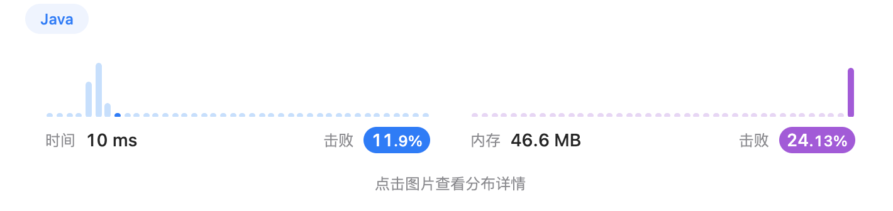
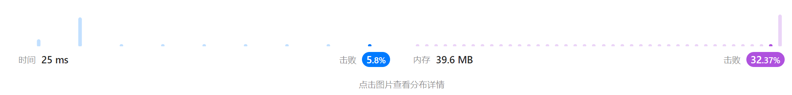
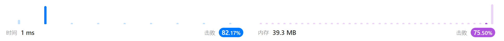

# Week 4 邰浩轩 2201212850 [AllCode](./Main.java)

## [Problem 56. 合并区间](https://leetcode.cn/problems/merge-intervals/)

> 以数组 `intervals` 表示若干个区间的集合，其中单个区间为 `intervals[i] = [starti, endi]`。
> 请你合并所有重叠的区间，并返回 一个不重叠的区间数组，该数组需恰好覆盖输入中的所有区间 。

```text
示例 1：

输入：intervals = [[1,3],[2,6],[8,10],[15,18]]
输出：[[1,6],[8,10],[15,18]]
解释：区间 [1,3] 和 [2,6] 重叠, 将它们合并为 [1,6].
        
     
示例 2：

输入：intervals = [[1,4],[4,5]]
输出：[[1,5]]
解释：区间 [1,4] 和 [4,5] 可被视为重叠区间。
```

### solution 1

首先可以对所有的数对根据左边界进行排序，排序后的数队拥有一下性质：

右侧的区间只需对上一个数对进行合并判断。

1. 若右侧数对的左边界大于左侧数对的右边借，因此可以直接加入结果数组
2. 反之，需要合并此数对至上一个数组，新的右边界取二者右边界的最大值

### code 1

```java
public int[][]merge(int[][]intervals){
    // 对所有数队进行排序
    Arrays.sort(intervals,(o1,o2)->o1[0]-o2[0]);

    // 保存结果
    List<int[]>merged=new ArrayList<>();
    for(int[]one:intervals){ // 对所有输队进行遍历
        // [1,5],[6,7] 无交集。直接添加
        if(merged.size()==0||one[0]>merged.get(merged.size()-1)[1]){
            merged.add(one);
        }
        // [1,5],[4,～] 遇到有交集的
        else if(one[0]<=merged.get(merged.size()-1)[1]){
            int[]replace=merged.get(merged.size()-1);
            replace[1]=Math.max(replace[1],one[1]); // 右侧边界取最大值
            merged.set(merged.size()-1,replace); // 替换为新的区间
        }
    }
    return merged.toArray(new int[merged.size()][]);
}
```

### result1



## [Problem 148. 排序链表](https://leetcode.cn/problems/sort-list/)

> 给你链表的头结点 `head`，请将其按 升序 排列并返回 排序后的链表。

```text
示例 1：

输入：head = [4,2,1,3]
输出：[1,2,3,4]
        
     
示例 2：

输入：head = [-1,5,3,4,0]
输出：[-1,0,3,4,5]
```

### solution 1

采用冒泡排序进行尝试。需要注意的点是，进行节点交换之后需要重置下标。该swap函数输入为待交换节点的前置节点。

```java
private void swapFromPreNode(ListNode preNode){
    ListNode l=preNode.next;
    if(l==null)return;
    // swap
    ListNode r=l.next;
    l.next=r.next;
    r.next=l;
    preNode.next=r;
}
```

```java
public ListNode sortListBubble(ListNode head){
    if(head==null||head.next==null) return head;
    ListNode newHead=new ListNode();
    newHead.next=head;
    int len=0;
    for(ListNode tmp=newHead.next;tmp!=null;tmp=tmp.next)len++;

    // 冒泡排序
    for(int i=0;i<len; i++) // 外层走一次
    {
        for(ListNode l=newHead.next,pre=newHead; // 定义当前比较节点与前一节点
        l.next!=null;  // 结束条件为l为最后一个节点
        l=l.next,pre=pre.next) // l与pre同时右移
            {
            if(l.val>l.next.val){
            swapFromPreNode(pre); // 交换l与l.next
            l=pre.next; // 交换之后需要重制l
            }
        }
    }
    return newHead.next;
}
```

该方法超时，需要实现时间复杂度为 $O(n \log n)$的算法。由于发现没有通过的测试样例
包含大量相同值，快速排序可能达到最坏时间复杂度，因此采用归并排序。

### solution 2

采用分治递归，寻找中点进行递归（使用快慢指针方法），合并有序链表。

```java
public ListNode sortList(ListNode head){
    return sortList(head,null);
}

public ListNode sortList(ListNode head,ListNode tail){
    if(head==null){
        return null;
    }
    if(head.next==tail){ // 遇到单个节点，不需要递归，直接返回
        head.next=null;
        return head;
    }
    
    ListNode slow=head,fast=head; // 定义快慢指针
    while(fast!=tail){ // 寻找中点
        slow=slow.next;
        fast=fast.next;
        if(fast!=tail){
            fast=fast.next;
        }
    }// 此时slow就是中点
    
    ListNode mid=slow;
    ListNode list1=sortList(head,mid); // 递归
    ListNode list2=sortList(mid,tail);
    return merge(list1,list2);

}

/**
 * 合并两个有序链表
 * @param head1 有序链表1
 * @param head2 有序链表2
 * @return 新头节点
 */
public ListNode merge(ListNode head1,ListNode head2){
    ListNode dummyHead=new ListNode(0); // 假头
    ListNode temp=dummyHead,temp1=head1,temp2=head2; // temp为res的尾节点
    while(temp1!=null&&temp2!=null){ // 连接l1与l2
        if(temp1.val<=temp2.val){
            temp.next=temp1;
            temp1=temp1.next;
        }else{
            temp.next=temp2;
            temp2=temp2.next;
        }
            temp=temp.next;
    }
    // 有链表剩余
    if(temp1!=null){
        temp.next=temp1;
    }else if(temp2!=null){
        temp.next=temp2;
    }
    return dummyHead.next;
}
```
### result


## [Problem 274. H 指数](https://leetcode.cn/problems/h-index/)

> 给你一个整数数组 `citations`，其中 `citations[i]` 表示研究者的第 `i` 篇论文被引用的次数。计算并返回该研究者的 `h` 指数。

根据维基百科上 `h` 指数的定义：`h` 代表“高引用次数”，一名科研人员的 h指数是指他（她）的 （`n` 篇论文中）总共有 `h` 篇论文分别被引用了至少 `h` 次。且其余的 `n - h` 篇论文每篇被引用次数不超过 `h` 次。

如果`h` 有多种可能的值，`h` 指数是其中最大的那个。

```text
输入：citations = [3,0,6,1,5]
输出：3 
解释：给定数组表示研究者总共有5篇论文，每篇论文相应的被引用了3, 0, 6, 1, 5 次。
     由于研究者有3篇论文每篇至少被引用了3次，其余两篇论文每篇被引用不多于3次，所以她的h指数是3。
     
输入：citations = [1,3,1]
输出：1
```

### solution 1
暴力枚举，枚举每一个可能的`h`（由`1`至`n`）。每次枚举过程中遍历一遍数组，计数大于`h`
的文章数，若最终`count`大于等于`h`，即该`h`满足条件。
```java
public int hIndex(int[] citations) {
    int total  = citations.length;
    int res = 0;

    for(int i = 0; i <= total; i++){ // 遍历每一个h
        int cnt = 0;
        for (int citation : citations) { // 遍历每一个引用次数
            if (citation >= i) {
                cnt++;
            }
        }

        if(cnt >= i){
            res = i;
        }
    }
    return res;
}
```
### result 1
时间复杂度较高， $O(n)$


### solution 2
对引用进行排序，排序后遍历一遍数组。观察其下标与总长度的关系，若`len-index`大于
当前值，则代表当前值可作为`h`。由此，如果当前指数为h并且在遍历过程中找到当前值 citations[i]>h，
则说明找到了一篇被引用了至少 h+1 次的论文，所以将现有的 h 值加 1。继续遍历直到 h 无法继续增大。
最后返回 h 作为最终答案。

```java
public int hIndex(int[] citations) {
    Arrays.sort(citations); // 排序
    int h = 0, i = citations.length - 1;
    while (i >= 0 && citations[i] > h) { // 遍历数组，当引用值高于h时继续
        h++;
        i--;
    }
    return h;
}
```
### result 2



