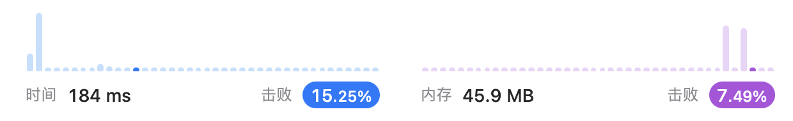

# Week 4 邰浩轩 2201212850 [AllCode](./Main.java)

## [Problem 5. 最长回文子串](https://leetcode.cn/problems/longest-palindromic-substring/)

> 给你一个字符串 s，找到 s 中最长的回文子串。
如果字符串的反序与原始字符串相同，则该字符串称为回文字符串。

```text
示例 1：

输入：s = "babad"
输出："bab"
解释："aba" 同样是符合题意的答案。
        
     
示例 2：

输入：s = "cbbd"
输出："bb"
```

### solution 1
暴力解法，枚举所有的子串，判断是否为回文串，记录最长的回文串。

### code 1
    
```java
public String longestPalindrome(String s) {
    int n = s.length();
    String ans = "";
    for (int i = 0; i < n; i++) {
        for (int j = i + 1; j <= n; j++) {
            String test = s.substring(i, j);
            if (isPalindrome(test) && test.length() > ans.length()) {
                ans = test;
            }
        }
    }
    return ans;
}

public boolean isPalindrome(String s) {
    int n = s.length();
    for (int i = 0; i < n / 2; i++) {
        if (s.charAt(i) != s.charAt(n - i - 1)) {
            return false;
        }
    }
    return true;
}
```
### solution 2

使用动态规划`dp`，`dp[i][j]`表示字符串s从i到j是否为回文串。
一个字符时，肯定是回文串，因此`dp[i][i]=true`。
两个字符时，若两个字符相同，则为回文串。
之后的字符，若`dp[i+1][j-1]=true`且`s[i]==s[j]`，则为回文串。
记录最长回文串的长度和起始位置，最后返回结果。

### code 2

```java
public String longestPalindrome(String s) {
    int n = s.length();
    boolean[][] dp = new boolean[n][n]; // dp[i][j] 表示 s[i..j] 是否是回文串
    String ans = "";
    for (int l = 0; l < n; l++) { // l表示子串长度，即为间隔
        for (int i = 0; i + l < n; i++) {
            int j = i + l;
            if (l == 0) {
                dp[i][j] = true; // 一个字符一定是回文串
            } else if (l == 1) { // 两个字符的情况
                dp[i][j] = (s.charAt(i) == s.charAt(j));
            } else { // 大于两个字符的情况
                dp[i][j] = (s.charAt(i) == s.charAt(j) && dp[i + 1][j - 1]);
            }
            if (dp[i][j] && l + 1 > ans.length()) { // 记录最长回文串
                ans = s.substring(i, i + l + 1);
            }
        }
    }
    return ans;
}
```

### result2



## [Problem 64. 最小路径和](https://leetcode.cn/problems/minimum-path-sum/)

> 给定一个包含非负整数的 m x n 网格 grid ，请找出一条从左上角到右下角的路径，使得路径上的数字总和为最小。

说明：每次只能向下或者向右移动一步。

```text
示例 1：

输入：grid = [[1,3,1],[1,5,1],[4,2,1]]
输出：7
解释：因为路径 1→3→1→1→1 的总和最小。
        
     
示例 2：

输入：grid = [[1,2,3],[4,5,6]]
输出：12
```

### solution 1

动态规划，`dp[i][j]`表示从左上角走到(i,j)的最小路径和。
初始化第一行和第一列，之后的状态转移方程为`dp[i][j]=min(dp[i-1][j],dp[i][j-1])+grid[i][j]`。
```java
public int minPathSum(int[][] grid) {
    int m = grid.length;
    int n = grid[0].length;
    int[][] dp = new int[m][n]; // dp[i][j] 表示从左上角走到 (i, j) 的最小路径和
    dp[0][0] = grid[0][0];
    for (int i = 1; i < m; i++) {
        dp[i][0] = dp[i - 1][0] + grid[i][0]; // 初始化第一列
    }
    for (int j = 1; j < n; j++) {
        dp[0][j] = dp[0][j - 1] + grid[0][j]; // 初始化第一行
    }
    for (int i = 1; i < m; i++) {
        for (int j = 1; j < n; j++) {
            dp[i][j] = Math.min(dp[i - 1][j], dp[i][j - 1]) + grid[i][j]; // 状态转移方程, 只能从上面或者左边走过来
        }
    }
    return dp[m - 1][n - 1];
}
```
### result 1

该方法可以优化，因为每次只需要用到上一行的数据，因此可以使用一维数组进行优化从而减少存储空空间。


## [Problem 120. 三角形最小路径和](https://leetcode.cn/problems/triangle/)

> 给定一个三角形 triangle ，找出自顶向下的最小路径和。
每一步只能移动到下一行中相邻的结点上。相邻的结点 在这里指的是 下标 与 上一层结点下标 相同或者等于 上一层结点下标 + 1 的两个结点。也就是说，如果正位于当前行的下标 i ，那么下一步可以移动到下一行的下标 i 或 i + 1 。


```text
输入：triangle = [[2],[3,4],[6,5,7],[4,1,8,3]]
输出：11
解释：如下面简图所示：
   2
  3 4
 6 5 7
4 1 8 3
自顶向下的最小路径和为 11（即，2 + 3 + 5 + 1 = 11）。
```

### solution 1
与上一题一样，采用动态规划的方法，`dp[i][j]`表示从顶点走到(i,j)的最小路径和。
```java
public int minimumTotal(List<List<Integer>> triangle) {
    int n = triangle.size();
    int[][] dp = new int[n][n]; // dp[i][j] 表示从三角形顶部走到 (i, j) 的最小路径和
    dp[0][0] = triangle.get(0).get(0);
    for (int i = 1; i < n; i++) {
        dp[i][0] = dp[i - 1][0] + triangle.get(i).get(0); // 初始化第一列
        for (int j = 1; j < i; j++) {
            dp[i][j] = Math.min(dp[i - 1][j - 1], dp[i - 1][j]) + triangle.get(i).get(j); // 状态转移方程, 只能从左上角或者上面走过来
        }
        dp[i][i] = dp[i - 1][i - 1] + triangle.get(i).get(i); // 最后一个元素单独处理，只能从左上角走过来
    }
    int minTotal = dp[n - 1][0];
    for (int j = 1; j < n; j++) {
        minTotal = Math.min(minTotal, dp[n - 1][j]);
    }
    return minTotal;
}
```
### result 1
时间复杂度：O(n^2)，空间复杂度：O(n^2)


