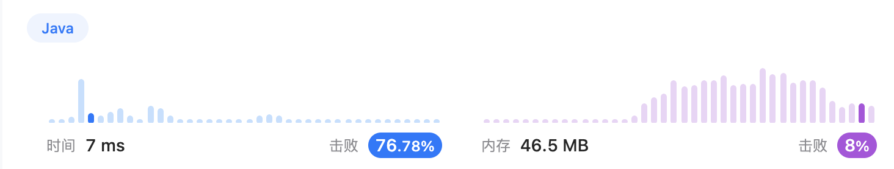
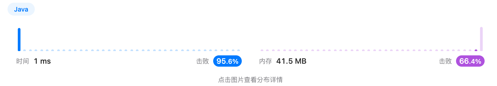

# Week 7
## [最大矩形(maximal-rectangle)](https://leetcode.cn/problems/maximal-rectangle/)
>
> 给定一个仅包含 0 和 1 、大小为 rows x cols 的二维二进制矩阵
> ，找出只包含 1 的最大矩形，并返回其面积。

```text
输入：matrix = [["1","0","1","0","0"],["1","0","1","1","1"],["1","1","1","1","1"],["1","0","0","1","0"]]
输出：6
```

### solution
先考虑84题：柱状图中最大的矩形
> 给定 n 个非负整数，用来表示柱状图中各个柱子的高度。每个柱子彼此相邻，且宽度为 1 。
> 求在该柱状图中，能够勾勒出来的矩形的最大面积。

```text
输入：heights = [2,1,5,6,2,3]
输出：10
```
**思路->单调栈**

归纳枚举「高」的方法：
首先我们枚举某一根柱子 i 作为高 h=heights[i]。
随后需要进行向左右两边扩展，使得扩展到的柱子的高度均不小于 h。换句话说，需要找到左右两侧最近的高度小于 h 的柱子，
这样这两根柱子之间（不包括其本身）的所有柱子高度均不小于 h，并且就是 i 能够扩展到的最远范围。

如果有两根柱子 j0 和 j1 ，其中 j0 在 j1 的左侧，并且 j0
的高度大于等于 j1 ，那么在后面的柱子 i 向左找小于其高度的柱子时，j1
会「挡住」j0 ，j0 就不会作为答案了。

可以对数组从左向右进行遍历，同时维护一个「可能作为答案」的数据结构，其中按照从小到大的顺序存放了一些 j 值。

因此创建一个栈存储可能的答案，当遇到更低的柱子时不断出栈找到边界，遇到更高的柱子入栈。
找到每个柱子的左右边界后可以直接计算面积。

**回到85题**
可以将85题转换为多个84题的子任务，便为从1层开始至第n层，每层看作多个柱状图，
调用第84题计算最大面积，在最大中取更大便为答案。

### code
由于代码过长，请于[此处](./Main.java)查看。
### res


## [152. 乘积最大子数组](https://leetcode.cn/problems/maximum-product-subarray/description/)
> 给你一个整数数组 nums ，请你找出数组中乘积最大的非空连续子数组（该子数组中至少包含一个数字），并返回该子数组所对应的乘积。
> 
> 测试用例的答案是一个 32-位 整数。
> 
> 子数组 是数组的连续子序列。
```text
输入: nums = [2,3,-2,4]
输出: 6
解释: 子数组 [2,3] 有最大乘积 6。

输入: nums = [-2,0,-1]
输出: 0
解释: 结果不能为 2, 因为 [-2,-1] 不是子数组。
```
### solution
与连续n项和类似，本题可以使用DP进行计算，但是乘法有正负之分。
需要正负性进行分类讨论，但同时维护两个数组，即最大数组与最小数组便可省去判断条件。

如果当前值为正数，显然需要乘以一个大于1的正数会变得更大，当前值为负数时，需要乘以一个小于-1的数，
就会变的更大，也就是我们期望之前的数字越小越好。

因此同时维护dpMax与dpMin

### code
```java
public int maxProduct(int[] nums) {
    int n = nums.length;
    int[] dpMin = new int[n]; // 最小dp
    int[] dpMax = new int[n]; // 最大dp

    dpMin[0] = dpMax[0] = nums[0];
    for(int i = 1; i < n; i++){ // 都是从三个值里去最值
        dpMin[i] = Math.min(dpMin[i - 1] * nums[i], Math.min(dpMax[i - 1] * nums[i], nums[i]));
        dpMax[i] = Math.max(dpMax[i - 1] * nums[i], Math.max(dpMin[i - 1] * nums[i], nums[i]));
    }
    int res = nums[0];
    for(int r:dpMax){
        res = Math.max(r, res);
    }
    return res;
}
```
### res


