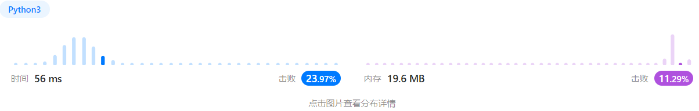

# Week 9
## [240. 搜索二维矩阵 II](https://leetcode.cn/problems/search-a-2d-matrix-ii/)
>
> 编写一个高效的算法来搜索 m x n 矩阵 matrix 中的一个目标值 target 。该矩阵具有以下特性：
> 
> 每行的元素从左到右升序排列。
> 
> 每列的元素从上到下升序排列。


```text
输入：matrix = [[1,4,7,11,15],[2,5,8,12,19],[3,6,9,16,22],[10,13,14,17,24],[18,21,23,26,30]], target = 5
输出：true

输入：matrix = [[1,4,7,11,15],[2,5,8,12,19],[3,6,9,16,22],[10,13,14,17,24],[18,21,23,26,30]], target = 20
输出：false
```

### solution
z字遍历。
从右上角开始。搜索过程中，
+ 如果matrix[x, y] = target, 说明搜索完成;

+ matrix[x,y]> target, 由于每列的元素都是升序排列的，那么在当前的搜索矩阵
中，所有位于第y列的元素都是严格大于target 的，因此我们可以将它们全部忽略，即
将y减少1;
+ matrix[x,y] < target, 由于每行的元素都是升序排列的，那么在当前的搜索矩阵
中，所有位于第x行的元素都是严格小于target 的，因此我们可以将它们全部忽略，即
将x增加1。


### code
```python
def searchMatrix(matrix: list[list[int]], target: int) -> bool:
    m = len(matrix)
    n = len(matrix[0])

    x = 0
    y = n - 1

    while x < m and y >= 0:
        if matrix[x][y] == target:
            return True
        elif matrix[x][y] > target:
            y -= 1
            continue
        else:
            x += 1
            continue

    return False
```

### res


## [347. 前 K 个高频元素](https://leetcode.cn/problems/top-k-frequent-elements/)
>
> 给你一个整数数组 nums 和一个整数 k ，请你返回其中出现频率前 k 高的元素。你可以按 任意顺序 返回答案。

```text
输入: nums = [1,1,1,2,2,3], k = 2
输出: [1,2]

输入: nums = [1], k = 1
输出: [1]
```


### solution 1
使用字典统计次数，然后排序。
```python
def topKFrequent(nums: list[int], k: int) -> list[int]:
    cnt_pair = {}
    for i in nums:
        cnt = cnt_pair.get(i, 0)
        cnt_pair[i] = cnt + 1

    cnt_list = list(cnt_pair.items())
    cnt_list = sorted(cnt_list, key=lambda x: x[1], reverse=True)
    res = []
    for i in range(k):
        res.append(cnt_list[i][0])
    return res
```

复杂度取决于排序的复杂度，因此为O(n log n)

### solution2
哈希+最小堆
```python
def topKFrequent2(nums: list[int], k: int) -> list[int]:
    # 方法二：哈希+最小堆
    # 时间复杂度：O(n log k)
    cnt = Counter(nums)
    l = list(zip(cnt.values(), cnt.keys()))
    hp = l[:k]
    heapify(hp)
    for item in l[k:]:
        heappushpop(hp, item)
    return [item[1] for item in hp]
```
### res


## [374. 猜数字大小](https://leetcode.cn/problems/guess-number-higher-or-lower/)
>
> 猜数字游戏的规则如下：
>
> 每轮游戏，我都会从 1 到 n 随机选择一个数字。 请你猜选出的是哪个数字。
> 如果你猜错了，我会告诉你，你猜测的数字比我选出的数字是大了还是小了。
> 你可以通过调用一个预先定义好的接口 int guess(int num) 来获取猜测结果，返回值一共有 3 种可能的情况（-1，1 或 0）：
> 
> -1：我选出的数字比你猜的数字小 pick < num
>
> 1：我选出的数字比你猜的数字大 pick > num
> 
> 0：我选出的数字和你猜的数字一样。恭喜！你猜对了！pick == num
> 
> 返回我选出的数字。

```text
输入：n = 10, pick = 6
输出：6

输入：n = 1, pick = 1
输出：1
```

### solution
二分查找。
```python
def guessNumber(n: int) -> int:
    l = 0
    r = n
    mid = n // 2
    while guess(mid) != 0:
        mid = (l + r) // 2
        new_guess = guess(mid)
        if new_guess == -1:
            r = mid - 1
        elif new_guess == 1:
            l = mid + 1

    return mid
```
