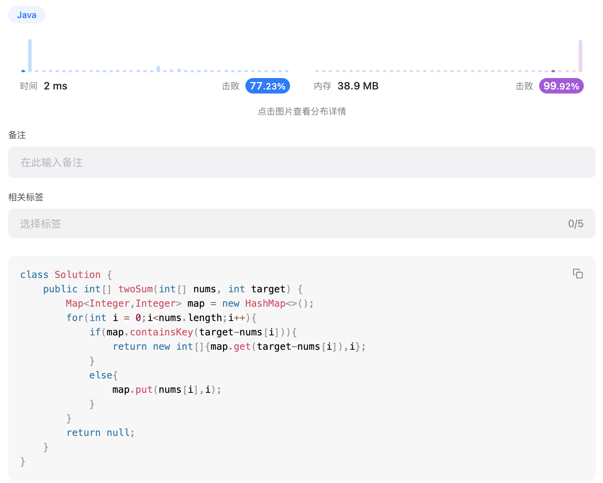
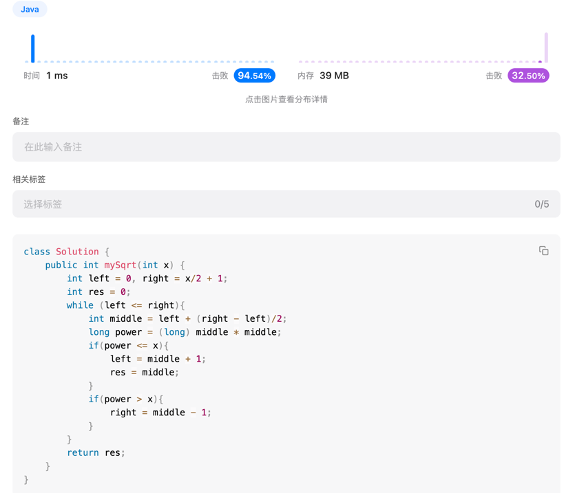

# Week 1 邰浩轩 2201212850
## Problem 1: two sum
### solution
遍历一遍数组，使用HashMap记录已有数值与index。如遇到目标数值，直接返回index
### code
```java
public int[] twoSum(int[] nums, int target) {
    Map<Integer,Integer> map = new HashMap<>(); // init the map
    for(int i = 0;i<nums.length;i++){ 
        if(map.containsKey(target-nums[i])){ // find the remain
            return new int[]{map.get(target-nums[i]),i};
        }
        else{
            map.put(nums[i],i); // record the value and index
        }
    }
    return null;
}
```
### image


## Problem 2: sqrt
### solution
二分计算平方根。难点为判断循环结束条件，即等于ot小于等于or小于。原因为取整为向下取整，当x为一个整数的平方时，若right为正确条件，
则需要left++，等于right时才可返回。
### code
```java
public int mySqrt(int x) {
    int left = 0, right = x/2 + 1; // init left and right. sqrt(x) <= x/2
    int res = 0; // record the res
    while (left <= right){ // `<=` need another loop when left=right e.g. x=2
        int middle = left + (right - left)/2;
        long power = (long) middle * middle;
        if(power <= x){
            left = middle + 1;
            res = middle;
        }
        if(power > x){
            right = middle - 1;
        }
    }
    return res;
}
```
### image


## Problem 3: climbStairs
### solution
递归，到达第n个台阶的方法为到达n-2再上2，或到达n-1再上1；初始化f(1) = 1, f(2) = 2
### code
```java
public int mySqrt(int x) {
    int left = 0, right = x/2 + 1; // init left and right. sqrt(x) <= x/2
    int res = 0; // record the res
    while (left <= right){ // `<=` need another loop when left=right e.g. x=2
        int middle = left + (right - left)/2;
        long power = (long) middle * middle;
        if(power <= x){
            left = middle + 1;
            res = middle;
        }
        if(power > x){
            right = middle - 1;
        }
    }
    return res;
}
```
### image

